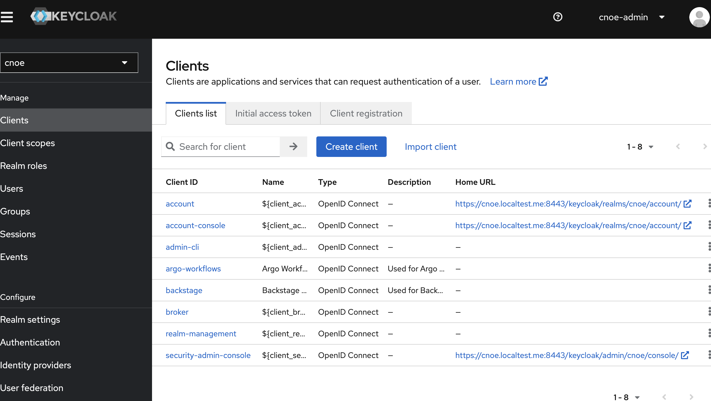

# Provisioning of CNOE IDP on a local Kind k8s cluster

The CNOE IPD platform provides configurable stacks that could be used for various use cases.

These example will use CNOE IPD with the following reference implementations:

1. [Reference Implementation][defref], that deploys the following components
    - Argo Workflows to enable workflow orchestrations.
    - Backstage as the UI for software catalog and templating. Source is available here.
    - External Secrets to generate secrets and coordinate secrets between applications.
    - Keycloak as the identity provider for applications.
    - Spark Operator to demonstrate an example Spark workload through Backstage.
2. [CrossPlain][defcp] integration for Backstage.
3. [Local Stack][deflocal] for testing cloud integrations.

References:

1. [Reference Implementation](https://github.com/cnoe-io/stacks/tree/main/ref-implementation)
  It contains useful info on accessing and signing-in with individual services.
2. [Crossplane integration](https://github.com/cnoe-io/stacks/tree/main/crossplane-integrations)
  This integration targets Backstage.

## Provisioning steps

Backstage deployment requires lots of CPU and Memory resources. Ensure the local Docker host is using configured to provide at least 6 CPU cores and 6 GB of RAM.

The deployment of the stack was successfully test on a MacOS with colima using these settings

`colima start --cpu 6 --memory 6`

Check [colima's](https://github.com/abiosoft/colima) GitHub page for more information

Provision CNOE IDP cluster. This might take several minutes depending on the available bandwidth and CPU/Memory resources availability.
```sh
> idpbuilder create --use-path-routing \
  --name refstack \
  --package https://github.com/cnoe-io/stacks//ref-implementation \
  --package https://github.com/cnoe-io/stacks//crossplane-integrations \
  --package https://github.com/cnoe-io/stacks//localstack-integration

# check the cluster availability
> kind get clusters
refstack
```

## Access CNOE services

If successful you should be able to access the following services

### ArgoCD

URL: [https://cnoe.localtest.me:8443/argocd](https://cnoe.localtest.me:8443/argocd)

Run `idpbuilder get secrets` to get user name and password.


### Gitea

The internal Git repo used primarily for demos.

URL: [https://cnoe.localtest.me:8443/gitea](https://cnoe.localtest.me:8443/gitea)

Run `idpbuilder get secrets` to get user name and password.


### KeyCloak

Keycloak is an open-source Identity and Access Management (IAM) solution developed by Red Hat. 

URL: [Keycloak](https://cnoe.localtest.me:8443/keycloak/admin/master/console/)

user: cnoe-admin
password: Run `idpbuilder get secrets` to get the value of `KEYCLOAK_ADMIN_PASSWORD`

select the `cnoe` realm once successful log-in to manage identities.



### Backstage

Backstage is an open source framework for building developer portals. Powered by a centralized software catalog, Backstage restores order to your microservices and infrastructure and enables your product teams to ship high-quality code quickly — without compromising autonomy.

Backstage unifies all your infrastructure tooling, services, and documentation to create a streamlined development environment from end to end.

URL: https://cnoe.localtest.me:8443/home

 There are two users set up in this configuration, and their password can be retrieved with the following command:

`idpbuilder get secrets`

Use the username **user1** and the password value given by USER_PASSWORD field to login to the backstage instance. **user1** is an admin user who has access to everything in the cluster, while **user2** is a regular user with limited access. Both users use the same password retrieved above.

Both users are managed by KeyCloak under the `cnoe` realm.


